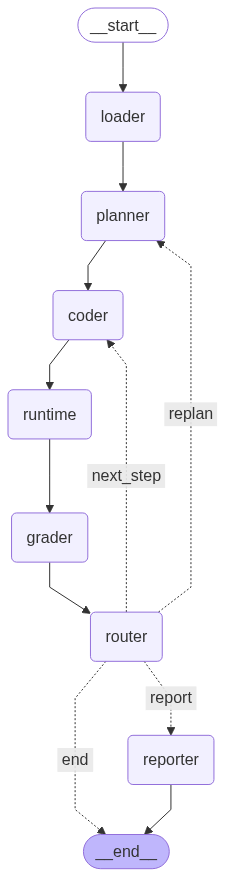

# MushkilViz: Multi-Agent Data Analysis & Visualization System

MushkilViz is an intelligent, LLM-powered multi-agent system for automated analysis and visualization of structured datasets. It uses a sophisticated workflow of specialized AI agents that collaborate to understand, analyze, and visualize data with minimal human intervention.

## 🏗️ Multi-Agent Architecture

MushkilViz employs a sophisticated multi-agent system built on LangGraph, where each agent has a specialized role in the analysis pipeline:



### 🤖 Agent Roles

- **📥 Loader Agent**: Inspects and profiles datasets, extracting schema information and sample data
- **🧠 Planner Agent**: Creates comprehensive analysis plans with ordered steps and expected outcomes
- **💻 Coder Agent**: Generates executable Python code for each analysis step
- **⚡ Runtime Agent**: Safely executes generated code in isolated environments
- **📊 Grader Agent**: Evaluates execution results and code quality, providing feedback
- **📋 Reporter Agent**: Synthesizes all findings into comprehensive reports and visualizations
- **🔄 Router Agent**: Manages workflow control flow and decision-making

### 🔄 Workflow Process

1. **Data Loading**: The Loader Agent examines the dataset and creates a comprehensive specification
2. **Planning**: The Planner Agent devises an analysis strategy with specific steps
3. **Code Generation**: The Coder Agent creates executable Python code for each analysis step
4. **Execution**: The Runtime Agent safely runs the code and captures outputs
5. **Evaluation**: The Grader Agent assesses results and determines next actions
6. **Routing**: The Router Agent decides whether to continue, retry, or move to reporting
7. **Reporting**: The Reporter Agent creates final comprehensive reports

## ✨ Key Features

- **🤖 Multi-Agent Collaboration**: Specialized AI agents working together for comprehensive analysis
- **🧠 Intelligent Planning**: Dynamic analysis planning based on data characteristics
- **🔒 Safe Execution**: Isolated code execution with safety controls and resource limits
- **📊 Quality Assurance**: Automated grading and feedback loops for continuous improvement
- **📈 Adaptive Workflows**: Self-correcting pipelines that can replan and regenerate as needed
- **🎯 Domain-Aware**: Context-sensitive analysis and visualization selection
- **📋 Comprehensive Reporting**: Rich markdown reports with insights, visualizations, and recommendations

## 🚀 Installation

```bash
# Clone the repository
git clone git@github.com:abdullah-athar/mushkil-viz.git
cd mushkil-viz

# Create and activate conda environment
conda env create -f environment.yml
conda activate mushkil

# Alternatively, use mamba for faster installation
mamba env create -f environment.yml
mamba activate mushkil

# Install dependencies
uv pip install -r requirements/requirements.txt 

# Copy env boilerplate and update variables
cp .env.example .env

# Set up your Google Gemini API key
echo "GOOGLE_GEMINI_KEY=your_actual_api_key_here" > .env
```

## 🎯 Quick Start

```python

python demo/test_framework.py

```

### Web Interface (Streamlit) - @waleed to fix TODO :D

```bash
# Run the Streamlit application
make run-app

# OR alternatively 
streamlit run src/mushkil_viz/streamlit/app.py --server.port=8501
```

Then open your browser to: **http://localhost:8501**

### Programmatic Usage

```python
from mushkil_viz.main import analyze_dataset_simple
from mushkil_viz.schema import DatasetFormat

# Analyze a dataset
result = analyze_dataset_simple(
    dataset_uri="path/to/your/data.csv",
    dataset_format=DatasetFormat.CSV
)

# Access the final report
print(result.final_report.analysis_summary)
```

## 📁 Project Structure

```
mushkil_viz/
├── src/mushkil_viz/
│   ├── agents/           # Multi-agent system components
│   │   ├── loader_agent.py
│   │   ├── planner_agent.py
│   │   ├── coder_agent.py
│   │   ├── grader_agent.py
│   │   └── reporter_agent.py
│   ├── nodes/            # Workflow orchestration nodes
│   │   ├── runtime_node.py
│   │   └── router_node.py
│   ├── schema.py         # Data models and state definitions
│   ├── main.py           # Main workflow orchestration
│   └── streamlit/        # Web interface
├── data/                 # Sample datasets and artifacts
├── examples/             # Usage examples
└── requirements/         # Dependency specifications
```

## 🔧 Configuration

MushkilViz uses environment variables for configuration:

```bash
# Required: Google Gemini API key
GOOGLE_GEMINI_KEY=your_api_key_here

# Optional: Model configuration
MUSHKIL_MODEL_NAME=gemini-2.0-flash
MUSHKIL_TEMPERATURE=0.1
MUSHKIL_MAX_TOKENS=4000

# Optional: Execution settings
MUSHKIL_MAX_ITERATIONS=3
MUSHKIL_ARTIFACTS_DIR=data/artifacts
```

## 🧪 Development

1. **Setup Development Environment**

```bash
# Install additional development dependencies
conda install -c conda-forge black flake8 isort pre-commit

# Run tests
pytest tests/

# Check code style
flake8 src/mushkil_viz/
black src/mushkil_viz/
```

2. **Adding New Agents**

Create new agents by extending the base agent class:

```python
from mushkil_viz.agents.base_agent import BaseAgent

class CustomAgent(BaseAgent):
    def process(self, state: WorkflowState) -> WorkflowState:
        # Implement your agent logic here
        return state
```

## 🤝 Contributing

1. Fork the repository
2. Create a feature branch
3. Commit your changes
4. Push to the branch
5. Create a Pull Request

## 📄 License

This project is licensed under the MIT License - see the [LICENSE](LICENSE) file for details.

## 🙏 Acknowledgments

- Built with [LangGraph](https://github.com/langchain-ai/langgraph) for multi-agent orchestration
- Powered by [Google Gemini](https://ai.google.dev/) for LLM capabilities
- Visualizations with [Plotly](https://plotly.com/python/)
- Data processing with [pandas](https://pandas.pydata.org/)
- Rich output formatting with [Rich](https://github.com/Textualize/rich)

## 📞 Contact

- GitHub Issues: [Report a bug](https://github.com/abdullah-athar/mushkil-viz/issues)
- Email: ama86@cantab.ac.uk / waleedhashmi@nyu.edu
- Authors: Waleed Hashmi and Abdullah Athar